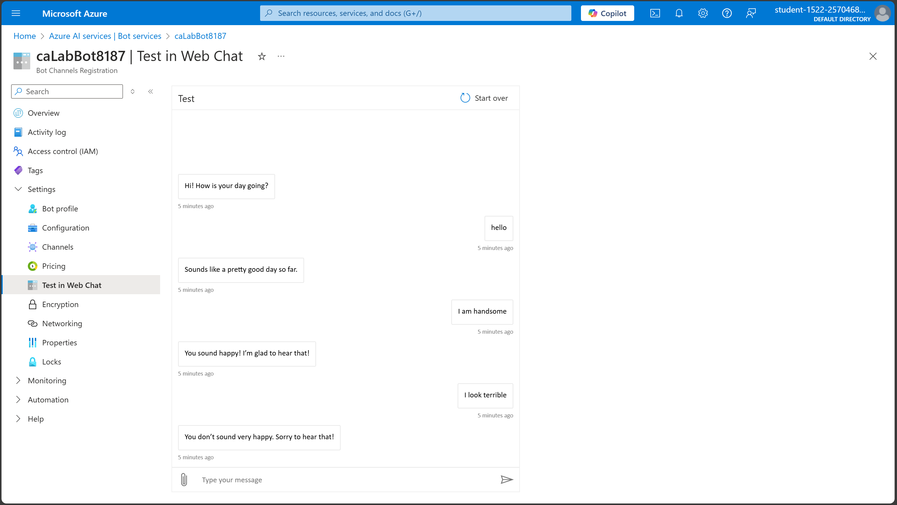

# Integrating Azure Bots with Azure AI Services

## Lab Steps
1. Logging in to the Microsoft Azure Portal
2. Retrieving Azure AI Services API Credentials
3. Connecting to the Lab Host Virtual Machine Using RDP
4. Creating an Azure Bot Locally
5. Integrating an Azure Bot with Azure AI Services
6. Deploy An Azure Bot Service Bot to Azure
7. Validating an Azure Bot Service Bot Deployment

## Description
Bots have a huge range of uses, including being used as virtual assistants, customer service reps, web app or microservice front ends,  and much more. Bots communicate naturally with customers and internal teams alike to provide intelligent, targeted solutions for nearly every business type.

Teams use Azure bots in part because of the tight integration they offer with most other Azure services. One common example is combining bots with AI services, to combine intelligent bots capable of understanding and responding intelligently to end-user comments. In this lab, you'll create an Azure bot, integrate it with the Azure AI Services API to allow it to guess the sentiment of end-users, and publish that bot to Azure Bot Service.

## Objectives
Upon completion of this lab you will be able to:
- Create Azure bots in a Node.js environment, using Yeoman
- Interact locally with the bot using the Bot Framework Emulator
- Integrate the bot with Azure AI Services API
- Deploy it to Azure Bot Service using the Azure CLI and Azure Resource Manager

## Reference
https://platform.qa.com/lab/integrating-azure-bots-azure-cognitive-services/

## Screenshot

